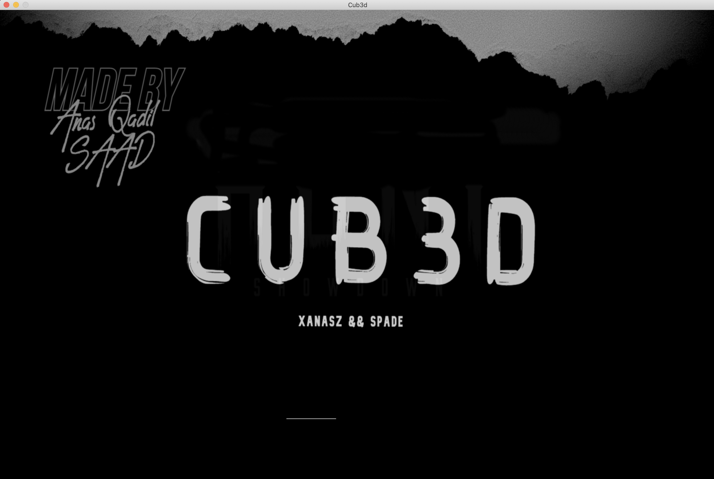

# CUB3D

This project is inspired by the world-famous eponymous 90’s game, Wolfenstein 3D.
It consists to create a 3D perspective in a 2D map making use of Raycast rendering technique and Minilibx library.

### I. Prerequisites

As the project uses minilibx library, its requires X11 library

### II. How to run the program

	git clone https://github.com/Anas-Qadil/cub3d.git
	'make' to compile the program
	$ ./cub3d <map_path/file.cub> to run the program

### III.  The Game

Key comands to move around the maze

* W A S D to move the point of view
* Left/Right (←/→) directional keys to rotate the camera
* Move Mouse Around To Rotate The Player
* 0 To Shot
* ESC to quit

### ScreenShots

 
<!--   -->